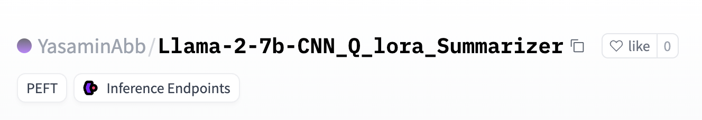
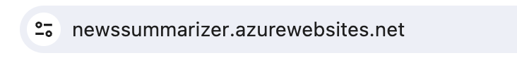
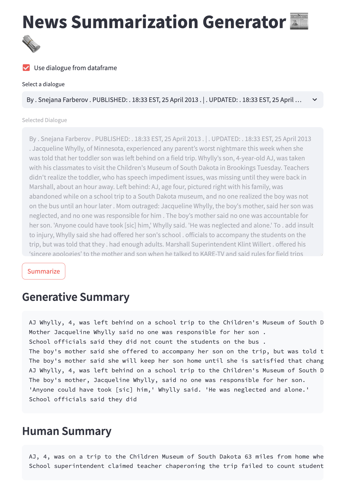
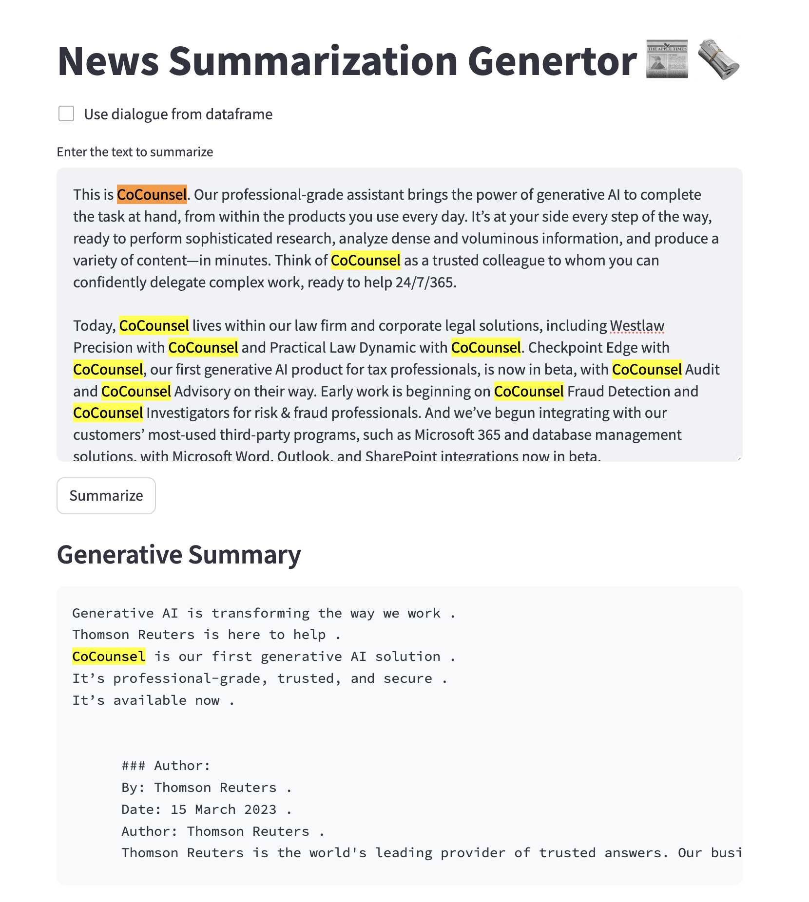

# News Summarizer using Llama2 Qlora

This is a News Summarizer application built using Llama2 Qlora. It summarizes news articles to provide concise and informative summaries.

## Finetuned Huggingface Card

You can access the News Summarizer Model [here](https://huggingface.co/YasaminAbb/Llama-2-7b-CNN_Q_lora_Summarizer/tree/main).

## Access the Azure Deployed Streamlit App

You can access the News Summarizer app [here](https://newssummarizer.azurewebsites.net/).

## Preview

  
   

## 
🚨 **Instance Deactivation Notice** 🚨

🔴 **Attention:** 

The instances for the app have been **deactivated temporarily**. 

⚠️ **What does this mean?** 

Access to the application is currently **unavailable**. 

🔒 **Why?**

To conserve resources and optimize performance, we've paused the instances. 

🔓 **What should I do?**

If you need to activate the instances or have any queries, please **reach out** to us. 

📧 **Contact:**

For any assistance, kindly send us a message or email us at [your contact email]. 

Thank you for your understanding and cooperation! 🙏

## Contributors

- Yasamin Abbaszadegan

## model_api_inference
### handler.py

- A handler in Hugging Face helps manage API endpoints.
- It acts like a middleman between incoming requests and the model.
- When someone sends a request to the API, the handler processes it.
- It sends the data to the model for prediction.
- Then, it formats the model's response before sending it back.
So, handlers are crucial for making sure the API works smoothly and interacts correctly with the deployed model.
