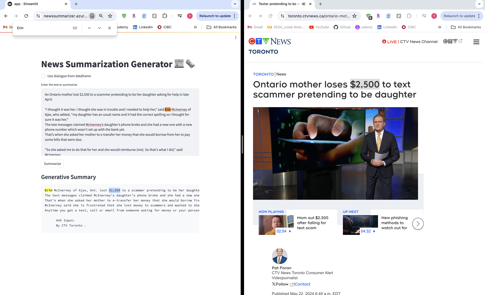

# News Summarizer using Llama2 Qlora

This is a News Summarizer application built using Llama2 Qlora. It summarizes news articles to provide concise and informative summaries.

## Finetuned Huggingface Card

You can access the News Summarizer Model [here](https://huggingface.co/YasaminAbb/Llama-2-7b-CNN_Q_lora_Summarizer/tree/main).

## Access the App

You can access the News Summarizer app [here](https://newssummarizer.azurewebsites.net/).

## Preview

  
   

## Contributors

- Yasamin Abbaszadegan

## License

